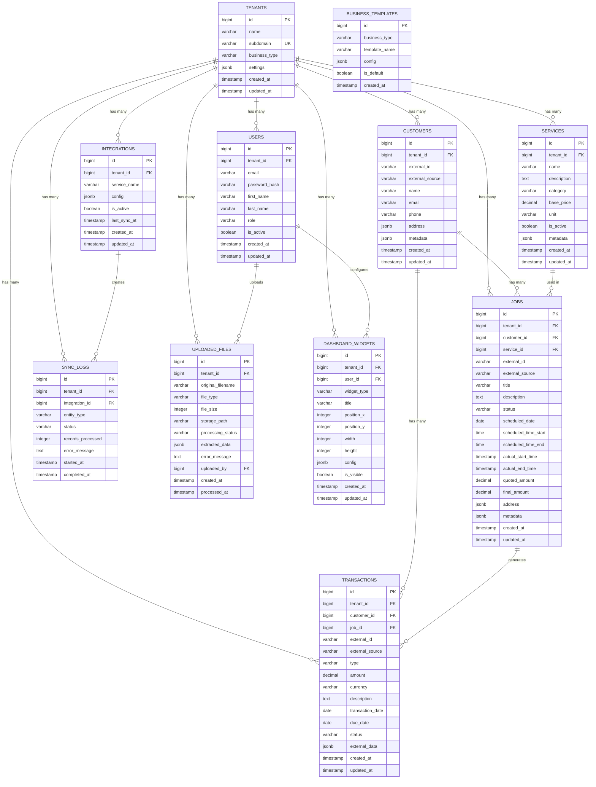

# Entity Relationship Diagram (ERD)

## Key Relationships

### **Core Business Flow**
1. **Tenants** → Multiple **Users** (company employees/admins)
2. **Tenants** → **Customers** (service recipients)
3. **Tenants** → **Services** (offerings like cleaning packages)
4. **Customers** + **Services** → **Jobs** (scheduled work)
5. **Jobs** → **Transactions** (invoices, payments)

### **Data Integration Flow**
1. **Tenants** → **Integrations** (QuickBooks, GoHighLevel configs)
2. **Integrations** → **Sync Logs** (tracking data imports)
3. **Users** → **Uploaded Files** (manual CSV/PDF imports)

### **Dashboard Customization**
1. **Tenants** → **Dashboard Widgets** (company-wide widgets)
2. **Users** → **Dashboard Widgets** (personal widgets)
3. **Business Templates** → Standalone (industry templates)

## Data Flow Patterns

### **Multi-Tenant Isolation**
Every major entity connects to `tenants(id)` ensuring complete data separation between companies.

### **External System Integration**
Tables include `external_id` and `external_source` to track data origins and maintain sync relationships.

### **Flexible Metadata**
JSONB `metadata` fields allow industry-specific customizations without schema changes.

### **Audit Trail**
Comprehensive timestamp tracking (`created_at`, `updated_at`, sync timestamps) for data lineage.

This ERD shows how the schema supports both the POC goals and future multi-tenant SaaS scaling while maintaining clean relationships and data integrity.